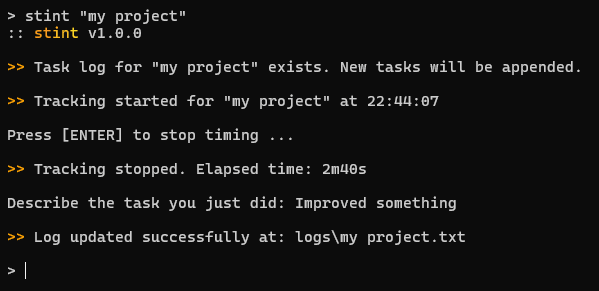

# stint

**stint** /stɪnt/ (_noun_): A fixed or limited period of time spent doing a particular job or activity.



This is a very lightweight, command-line based time tracker written in Go. Its primary function is to track the amount of time you spend on tasks.

No accounts, no databases, no telemetry, no complex admin panels with hundred billion features, just the command line and you. The output is a simple textfile with an ASCII-formatted table.

## Installation

If you have the Go SDK installed, you can build and register the application globally very simply:

```bash
go install ./cmd/stint
```

You can also compile the binaries manually:

```bash
# windows
go build -o stint.exe ./cmd/stint
# linux / mac
go build -o stint ./cmd/sting
```

Or you can grab the binaries from [releases](https://github.com/metayeti/stint/releases).

By default, logs will appear under logs/ wherever you choose to run the program. If you wish to change this to a concrete path, simply change the `outputDir` constant in `cmd/stint/main.go` to your desired path (line [41](https://github.com/metayeti/stint/blob/main/cmd/stint/main.go#L41)).

## How to Use

Using stint is as easy as A-B-C.

1. Invoke `stint` using a single argument specifying the project you wish to work on:

```bash
stint "My Project"
```

2. Work on your project.

3. When you're done with your task, open the terminal where stint is running and press ENTER.

4. You will be asked to describe the task you just did. Use a sentence or two, or more if you want.

5. A log will be generated or appended to in `/logs/My Project.txt`

An example log will look something like this:

```text
+--------------+---------------+-------------------------------------+----------------------+
| Date         | Time          | Description                         | Duration             |
+--------------+---------------+-------------------------------------+----------------------+
| 2026-05-19   | 10:00 - 11:30 | Setup initial repository design     | 1h30m0s              |
| 2026-05-19   | 14:00 - 15:45 | Fixed authorization edge-case bugs  | 1h45m12s             |
|              |               | and refactored middleware checks    |                      |
| 2026-05-20   | 09:15 - 09:45 | Documentation cleanups              | 30m0s                |
+--------------+---------------+-------------------------------------+----------------------+
| Total        |               |                                     | 3h45m12s             |
+--------------+---------------+-------------------------------------+----------------------+
```

Basically, for every task on your project, run `stint "My Project"`, when you're done describe what you just did, and let stint track time for you.

## Note

Parts of this project were coded using Gemini and there may be bugs. This program has not yet been battle tested, so don't trust it with critical stuff just yet.

## License

Copyright &copy; 2026 Danijel Durakovic

Licensed under the terms of the [MIT license](LICENSE)
